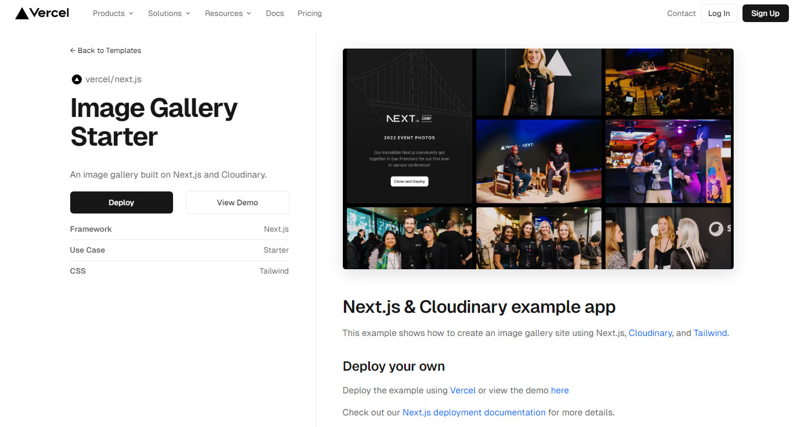
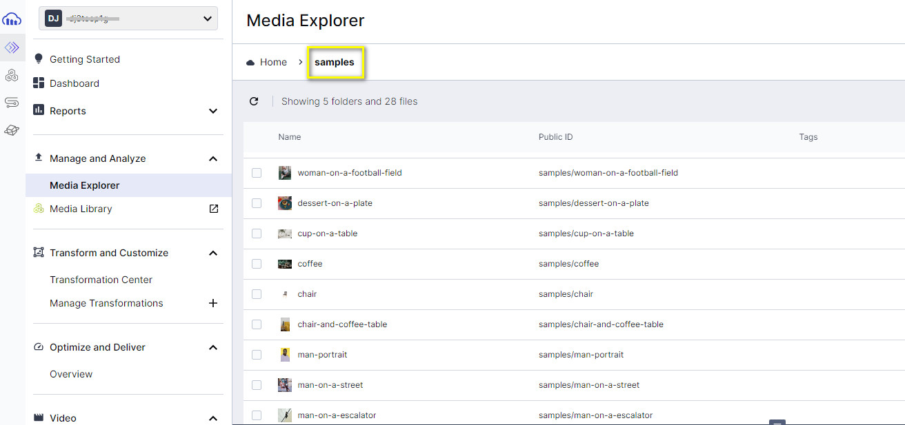
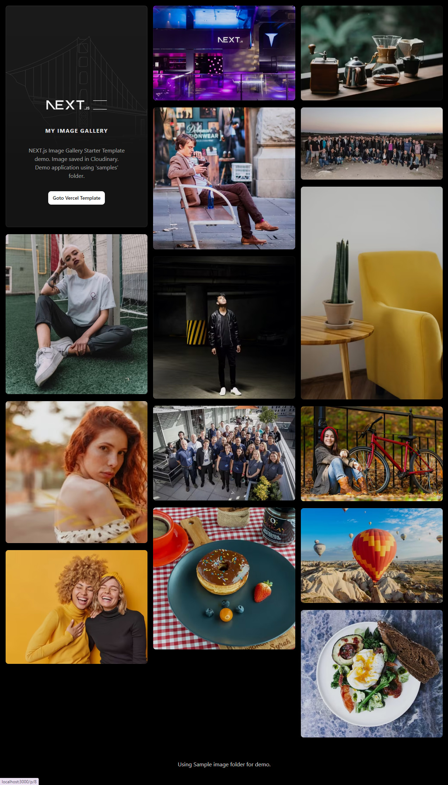
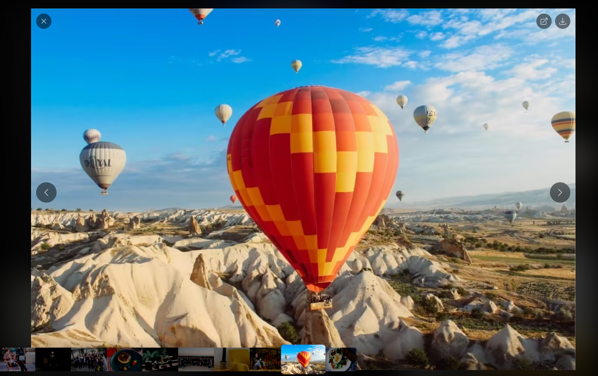

# nextjs-cloudinary-imageGallery 
Demo of Next.JS Image Gallery Starter Template with image storage in Cloudinary

## Components

This example application is created from Vercel's image gallery template running Next.js, [Cloudinary](https://cloudinary.com), and [Tailwind](https://tailwindcss.com).




The demo image are come from 'Sample' folder



## 1. Create the Demo application


```bash
 npx create-next-app --example with-cloudinary nextjs-image-gallery
```

## 2. Update Configuration 
- Get the API key (create free account, if needed)


- Rename the '.env.local.example' to '.env'
- Update the Account name, API key and folder to show

'''
NEXT_PUBLIC_CLOUDINARY_CLOUD_NAME=xxxx
CLOUDINARY_API_KEY=xxxxx
CLOUDINARY_API_SECRET=xxxxxx
CLOUDINARY_FOLDER="Samples"
'''

## Fix Error: Invalid src prop on `next/image`, hostname "res.cloudinary.com" is not configured under images in your `next.config.js`

- During 'npm run dev' if 'Invalid src' prompted, remark or remove 'port' and 'pathname' in next.config.js file

'''
// next.config.js
module.exports = {
  images: {
    formats: ["image/avif", "image/webp"],
    remotePatterns: [
      {
        protocol: "https",
        hostname: "res.cloudinary.com",
        //port: "",
        //pathname: "/my-account/**",
      },
    ],
  },
};
'''

## Deployment

- Complie and Run production code

'''
npm run build

npm run start
'''

- Open browser and access to http://localhost:3000/

- Home Page


- Clcik on any image



